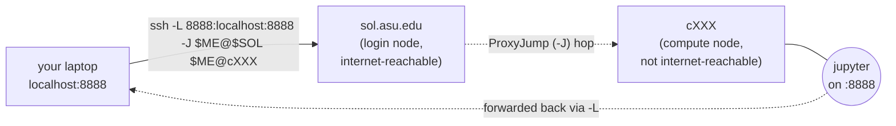

# Sessions and tunneling - manual SSH

The laptop ↔ Sol dev loop, entirely through the user's existing
`ssh` client - no extra tooling, no reads of `~/.ssh/*`. Use this
when Open OnDemand isn't the right fit (terminal-driven workflow,
custom env vars, multiple ports, scripts that wrap the allocation).

> **Substitute the username once.** At the start of the session, run
> `whoami` and reuse the result throughout. The examples below set
> `ME=$(whoami)` once and reference `$ME` afterward. Do not emit
> angle-bracket username placeholders to the user - substitute first.

## The shape of the problem

To work on Sol from a laptop you need two things:

1. A running Slurm allocation on a **compute node**.
2. SSH tunnels from the laptop to that compute node so localhost
   servers (Jupyter, dev server, OAuth callback) reach you.

The login node (`sol.asu.edu`) is reachable from the internet; compute
nodes are not. Every laptop ↔ compute-node connection therefore has to
chain through the login node with `-J` (ProxyJump). The single command
on the laptop builds the whole chain - SSH dials the login node, hops
to the compute node via ProxyJump, and the `-L` flag forwards the
compute-node port back to the laptop:



## 0. One-time per shell

```shell
ME=$(whoami)
SOL=sol.asu.edu          # change if you use a custom Host alias
```

If you maintain a `Host sol` alias in your own `~/.ssh/config`, set
`SOL=sol` instead. This doc never reads or modifies your ssh config.

## 1. Start an interactive session on a compute node

From the laptop, SSH to the login node:

```shell
ssh $ME@$SOL
```

On the login node, request an allocation. **Match the partition to the
job's wall-time**, not the request size - Sol's `htc` partition is the
right home for anything that fits its 4-hour wall (debug, smoke-tests,
short GPU runs). `htc` carries a large GPU pool (hundreds of A100s,
plus H100 / L40 / A30), so a short *GPU* shell belongs there too - not
just CPU work. Save `public` (7-day wall) for runs that genuinely need
more than 4 hours. Picking `public` for a 30-minute shell - GPU or not -
wastes capacity that someone else is queued for.

```shell
# Lightweight debug — short shell, modest resources.
# "I just want to test a command" / "inspect a compute node briefly."
interactive -p htc -t 0-01:00 -c 4 --mem=16G

# Short GPU shell — an A100 for a quick test/ablation; fits htc's 4h.
interactive -p htc -t 0-04:00 -c 8 --mem=64G -G a100:1

# Longer run that needs more than htc's 4-hour wall → public (7-day).
interactive -p public -t 1-00:00 -c 8 --mem=32G
```

If the user describes the work as "quick", "debug", "lightweight",
"just need to check", or names a wall-time at or under 4 hours - that's
an `htc` request, GPU or not. Don't default to `public` in those cases;
only a need for more than 4 hours (or a node shape htc lacks) does. For
a ≤15-minute test that needs to start *now*, the `debug` QOS (`-p public
-q debug`, very high priority, GPUs allowed - but not valid on `htc`) is
the fast lane.

When the allocation lands, the prompt changes and you are now on a
compute node. **Capture the node hostname** - you will need it from
the laptop:

```shell
hostname -s     # e.g. cg001
```

Leave this shell open. Closing it releases the allocation.

## 2. Start the localhost server on the compute node

In the same compute-node shell, start whatever you need to reach.
Examples:

```shell
# Jupyter (no browser, no token-rewrite, bound to loopback)
jupyter lab --no-browser --ip=127.0.0.1 --port=8888

# Plain Python dev server
python -m http.server 8000 --bind 127.0.0.1
```

Bind to `127.0.0.1`, never `0.0.0.0` - the tunnel does not need a
network-facing socket and binding publicly invites trouble on a shared
node.

## 3. Open the tunnel from the laptop

In a **second laptop terminal** (the first one is your interactive
shell on the login/compute node), build the chained tunnel.

Replace `cg001` with whatever `hostname -s` reported in step 1.

```shell
NODE=cg001        # from step 1
ssh -N -L 8888:localhost:8888 -J $ME@$SOL $ME@$NODE
```

What each flag does:

| Flag | Purpose |
| --- | --- |
| `-N` | Don't run a remote command - tunnel only. |
| `-L 8888:localhost:8888` | Laptop port 8888 -> compute-node port 8888. |
| `-J $ME@$SOL` | ProxyJump through the login node. |

Now `http://localhost:8888` on the laptop reaches the Jupyter on the
compute node. Leave this terminal running; Ctrl-C closes the tunnel.

### Forwarding multiple ports

Stack `-L` flags. One common pair: Jupyter (8888) + TensorBoard
(6006).

```shell
ssh -N \
    -L 8888:localhost:8888 \
    -L 6006:localhost:6006 \
    -J $ME@$SOL $ME@$NODE
```

## 4. OAuth callbacks: laptop ▶ compute node (`-R`)

Some flows (e.g. `gh auth login`, cloud SDK browser logins) start a
web server on the **laptop** and ask the remote process to open a
URL pointing at it. The remote process can't reach the laptop without
a reverse tunnel.

```shell
# Laptop: forward laptop:53682 → compute-node:53682
ssh -N -R 53682:localhost:53682 -J $ME@$SOL $ME@$NODE
```

Now anything on the compute node hitting `http://localhost:53682`
reaches the OAuth helper running on your laptop. Pick whichever port
the tool prints; some hard-code it (`gcloud` uses 8085, `gh` uses an
ephemeral port - read the prompt).

## 5. Diagnostics

### "Address already in use"

A previous session on either side may have left a process or a stale
`-L`/`-R` binding.

On the laptop:

```shell
lsof -iTCP:8888 -sTCP:LISTEN     # macOS / BSD-style lsof
ss   -tlnp 'sport = :8888'       # Linux
```

On the compute node, same commands. Kill the offender or pick a
different local port (`-L 8889:localhost:8888`).

### Is the ControlMaster still up?

If you have `ControlMaster auto` in your own ssh config (this doc does
not write it for you), check and tear it down explicitly:

```shell
ssh -O check $ME@$SOL          # "Master running" or "No ControlMaster"
ssh -O exit  $ME@$SOL          # close the master cleanly
```

Closing the master forces the next `-J` chain to re-auth (Duo prompt).
Useful when a tunnel hangs and you want a clean slate.

### "Did I run -L on the wrong side?"

A `-L` issued from the **compute node** binds the compute node's
loopback, not the laptop's. If `http://localhost:8888` on the laptop
still 404s, check which side the shell you ran `-L` in is actually
on. The chained form in step 3 must be issued **from the laptop**.

Quick sanity check:

```shell
command -v sacctmgr   # nothing → laptop. A path → you're on Sol.
```

If `sacctmgr` resolves to a path you are on Sol - abort and re-run
the `-L` from a laptop terminal.

### Tunnel established but page won't load

In order, check:

1. Server actually listening on `127.0.0.1` on the compute node:
   `ss -tlnp 'sport = :8888'` from the compute-node shell.
2. Tunnel still up on the laptop: `ss -tlnp 'sport = :8888'` (Linux)
   or `lsof -iTCP:8888 -sTCP:LISTEN` (macOS).
3. Browser: try `curl -v http://localhost:8888` - rules out browser
   caching/extensions.

## 6. Tear down

- Stop the localhost server on the compute node (Ctrl-C in step 2).
- Close the tunnel terminal on the laptop (Ctrl-C in step 3).
- Release the allocation: `exit` from the interactive shell, or run
  `scancel <jobid>` from the login node (`squeue -u $ME` lists your
  jobs).

## See also

- [slurm.md](slurm.md) - non-interactive job submission via SBATCH.
- [module.md](module.md) - loading software inside the interactive
  shell before starting a server.
